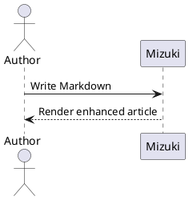
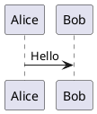

## 目录

- [GitHub 仓库卡片](#github-repository-cards)
- [提示框（Admonitions）](#admonitions)
  - [基础语法](#admonitions-basic)
  - [自定义标题](#admonitions-custom)
  - [GitHub 语法](#admonitions-github)
  - [剧透](#admonitions-spoiler)
- [代码组](#code-groups)
  - [长代码自动折叠](#code-groups-collapse)
- [扩展提示框](#extended-callouts)
- [Wiki 链接](#wiki-links)
- [Markdown 图片](#markdown-images)
- [自动图片网格](#automatic-image-grids)
- [PlantUML](#plantuml)
- [化学式](#chemistry)


## GitHub 仓库卡片

<a id="github-repository-cards"></a>

你可以添加指向 GitHub 仓库的动态卡片，页面加载时会通过 GitHub API 拉取仓库信息。

::github{repo="LyraVoid/Mizuki"}

使用代码 `::github{repo="LyraVoid/Mizuki"}` 创建一个 GitHub 仓库卡片。

```markdown
::github{repo="LyraVoid/Mizuki"}
```

## 提示框（Admonitions）

<a id="admonitions"></a>


支持以下类型的提示框：

:::note
即使用户只是快速浏览，也应留意的重要信息。
:::

:::tip
帮助用户更顺利完成的补充信息。
:::

:::important
用户顺利完成所必须的关键信息。
:::

:::warning
因潜在风险而需要用户立即关注的关键内容。
:::

:::caution
某项操作可能带来的负面后果。
:::

### 基础语法

<a id="admonitions-basic"></a>


```markdown
:::note
Highlights information that users should take into account, even when skimming.
:::

:::tip
Optional information to help a user be more successful.
:::
```

### 自定义标题

<a id="admonitions-custom"></a>


提示框的标题可以自定义。

:::note[MY CUSTOM TITLE]
这是一张带自定义标题的提示框。
:::

```markdown
:::note[MY CUSTOM TITLE]
This is a note with a custom title.
:::
```

### GitHub 语法

<a id="admonitions-github"></a>


> [!TIP]
> [GitHub 语法](https://github.com/orgs/community/discussions/16925) 同样受支持。

```
> [!NOTE]
> The GitHub syntax is also supported.

> [!TIP]
> The GitHub syntax is also supported.
```

### 剧透

<a id="admonitions-spoiler"></a>


你可以为文本添加剧透。文本同样支持 **Markdown** 语法。

这段内容 :spoiler[隐藏了 **ayyy**]！

```markdown
The content :spoiler[is hidden **ayyy**]!
```

## 代码组

<a id="code-groups"></a>


使用 VitePress 风格的 `::: code-group labels=[...]` 语法，把相关的示例以可访问的选项卡形式呈现。
选项卡支持鼠标操作以及
<kbd>Left</kbd>、<kbd>Right</kbd>、<kbd>Home</kbd> 和 <kbd>End</kbd> 按键。

::: code-group labels=[TypeScript, Shell, Collapsed]

```ts title="config.ts" showLineNumbers {2} ins={3}
export const config = {
  framework: "Mizuki",
  enhanced: true,
};
```

```bash title="Build"
pnpm check && pnpm build
```

```js collapse={1-3}
import { one } from "one";
import { two } from "two";
import { three } from "three";
console.log(one, two, three);
```

:::

````markdown
::: code-group labels=[TypeScript, Shell]

```ts title="config.ts"
export const framework = "Mizuki";
```

```bash title="Build"
pnpm build
```

:::
````

### 长代码自动折叠

<a id="code-groups-collapse"></a>


超过配置阈值的代码块会自动折叠。
作者仍可继续使用 `collapse={...}` 来折叠指定的行范围。

```text
01
02
03
04
05
06
07
08
09
10
11
12
13
14
15
16
17
18
19
20
21
22
```

## 扩展提示框

<a id="extended-callouts"></a>


除 GitHub 的五种提醒类型外，Mizuki 还接受 Obsidian 的常见别名，例如
`INFO`、`TODO`、`SUCCESS`、`QUESTION`、`DANGER`、`BUG`、
`EXAMPLE` 和 `QUOTE`。

> [!BUG] Known limitation
> 扩展别名会被映射到 Mizuki 的语义化提示框样式。

同时也支持 Python Markdown 与 Docusaurus 风格的指令：

:::danger[Danger directive]
这条指令使用了自定义标题。
:::

```markdown
> [!BUG] Known limitation
> Describe the known issue here.

:::danger[Danger directive]
This directive uses a custom title.
:::
```

## Wiki 链接

<a id="wiki-links"></a>


Obsidian 风格的 Wiki 链接可解析文章路径、别名与标题锚点。
单独的链接会成为一个文章卡片：

[[guide]]

卡片会复用目标文章的封面。相对封面从目标文章解析，
同时也支持公共、远程以及配置了 `image: api` 的封面。
加密文章在预览中绝不会暴露其封面。

行内链接保持行内。例如
[[markdown-mermaid|Mermaid 示例]]，或直接链接到
[[markdown-mermaid#Flowchart Example|某个章节]]。

```markdown
[[markdown-mermaid]]

See [[markdown-mermaid|the Mermaid examples]].
```

## Markdown 图片

<a id="markdown-images"></a>


图片的替代文本对辅助技术仍然可用。Markdown 标题会作为可见的图注显示，
可选的合法 `w-N%` 标记用于控制显示宽度：


```markdown

```

仅接受 `w-1%` 到 `w-100%` 之间的宽度。`imageOptimization.noReferrerDomains` 中的
远程图片主机，会在初始 HTML 中收到 `referrerpolicy="no-referrer"`。
若希望保留自定义标记，可为原生 HTML 图片或其祖先元素添加 `data-no-enhance`；
这样自定义标记就不会被额外处理。

```html
<div data-no-enhance>
  
</div>
```

## 自动图片网格

<a id="automatic-image-grids"></a>


两张或以上相邻的独立图片会被组合成一个响应式画廊。
当需要自定义列数、宽高比或
对象填充方式时，仍可使用显式的 `:::grid` 指令。


```markdown


```

## PlantUML

<a id="plantuml"></a>


PlantUML 代码块会通过配置的服务器生成 SVG 图表。图表支持
明/暗两种来源，以及缩放、拖动、重置和
全屏查看。



````markdown

````

## 化学式

<a id="chemistry"></a>


KaTeX 的 `mhchem` 扩展可渲染化学方程式：

$$
\ce{H2O + CO2 -> H2CO3}
$$
